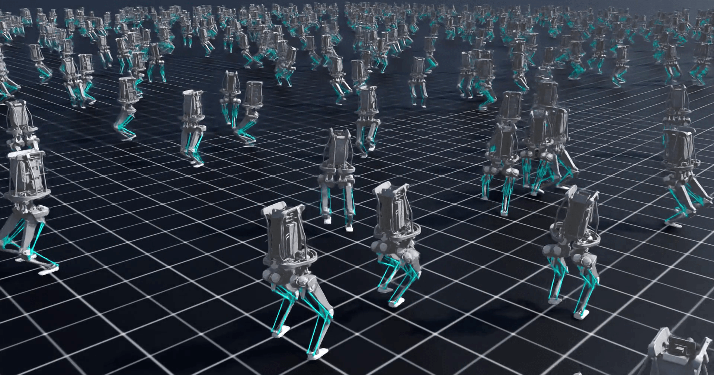

# Isaac Lab Kangaroo

[](https://docs.isaacsim.omniverse.nvidia.com/latest/index.html)
[](https://docs.python.org/3/whatsnew/3.10.html)
[](https://opensource.org/licenses/BSD-3-Clause)



This project contains [Isaac Lab](https://isaac-sim.github.io/IsaacLab/main/index.html) locomotion tasks for the [Kangaroo robot](https://pal-robotics.com/robot/kangaroo/) from PAL Robotics (1st version).
The repository contains both the environment definitions and the USD models of the robot.
It allows you to develop in an isolated environment, outside of the core Isaac Lab repository.
*(Built using [Isaac Lab External Project Template](https://isaac-sim.github.io/IsaacLab/main/source/overview/developer-guide/template.html))*

**Available Tasks:**

- `Kangaroo-Locomotion-Flat-v0` Locomotion on flat terrains (**tested**).
- `Kangaroo-Locomotion-Rough-v0` Locomotion on rough terrains (**not tested yet**).

## Installation

- Install Isaac Lab by following the [installation guide](https://isaac-sim.github.io/IsaacLab/main/source/setup/installation/index.html).
  We recommend using the conda/venv installation as it simplifies calling Python scripts from the terminal.

- Clone or copy this repository separately from the Isaac Lab installation (i.e. outside the `IsaacLab` directory):

- Using a python interpreter that has Isaac Lab installed (use `FULL_PATH_TO_isaaclab.sh|bat -p` instead of `python` if Isaac Lab is not installed in Python venv or conda), install the library in editable mode using:

    ```bash
    python -m pip install -e source/isaaclab_kangaroo
    ```

- Verify that the extension is correctly installed by:

  - Listing the available tasks:

    ```bash
    python scripts/list_envs.py
    ```

  - Spawning a Kangaroo in Isaac Sim:

      ```bash
      python scripts/<RL_LIBRARY>/spawn_kangaroo.py
      ```

  - Running a task with dummy agents:

    - Zero-action agent

        ```bash
        python scripts/zero_agent.py --task=<TASK_NAME>
        ```

    - Random-action agent

        ```bash
        python scripts/random_agent.py --task=<TASK_NAME>
        ```

### Set up IDE (Optional)

To setup the IDE, please follow these instructions:

- Run VSCode Tasks, by pressing `Ctrl+Shift+P`, selecting `Tasks: Run Task` and running the `setup_python_env` in the drop down menu.
  When running this task, you will be prompted to add the absolute path to your Isaac Sim installation.

If everything executes correctly, it should create a file .python.env in the `.vscode` directory.
The file contains the python paths to all the extensions provided by Isaac Sim and Omniverse.
This helps in indexing all the python modules for intelligent suggestions while writing code.

## Example Usage

- **Running a training** in headless mode (this will create a `logs` folder inside the main repository to log training results).

    ```bash
    python scripts/train.py --task=Kangaroo-Locomotion-Flat-v0 --headless
    ```

- **Playing the trained policy** while recording a video (inside the `logs` folder).

    ```bash
    python scripts/play.py --task=Kangaroo-Locomotion-Flat-v0 --num_envs=8 --video --headless
    ```

## Code formatting

We have a pre-commit template to automatically format your code.
To install pre-commit:

```bash
pip install pre-commit
```

Then you can run pre-commit with:

```bash
pre-commit run --all-files
```

## BibTeX

```
@article{amadio2025learning,
  title={Learning to Walk with Hybrid Serial-Parallel Linkages: a Case Study on the Kangaroo Robot},
  author={Amadio, Fabio and Li, Hongbo and Uttini, Lorenzo and Ivaldi, Serena and Modugno, Valerio and Hoffman, Enrico Mingo},
  year={2025}
}
```
